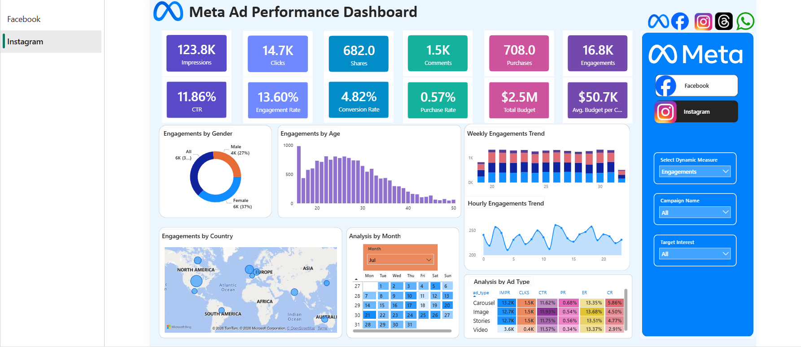

# 📊 Meta Ads Performance Dashboard (Power BI)

## 📌 Project Overview

This project analyzes Meta (Facebook & Instagram) ad campaign performance to provide actionable insights for marketing optimization. The dashboard tracks the full funnel from impressions to purchases and helps identify opportunities to improve conversion rates.

## 🎯 Business Objective

* Track campaign performance across Facebook and Instagram
* Analyze user engagement and conversion behavior
* Optimize budget allocation and improve ROI
* Identify high-performing audience segments

## 📊 Dashboard Features

* KPI Cards:
  Impressions, Clicks, Shares, Comments, Purchases, Engagements

* Performance Metrics:
  CTR (Click Through Rate), Engagement Rate, Conversion Rate, Purchase Rate

* Budget Analysis:
  Total Budget, Average Budget per Campaign

* Funnel Analysis:
  Tracks user journey from Impressions → Clicks → Engagement → Purchases

* Audience Insights:
  Analysis by Age Group and Gender

* Geographic Insights:
  Country-level performance visualization

* Time-based Analysis:

  * Weekly Trends (performance variation across weeks)
  * Hourly Trends (user activity throughout the day)

* Monthly Analysis (Calendar View):

  * Interactive calendar heatmap to analyze performance by date
  * Highlights peak activity days and seasonal trends
  * Custom tooltip on hover showing detailed KPIs (Impressions, Clicks, CTR, Engagement, Budget, etc.)

* Ad Type Performance:
  Comparison across different ad formats (Video, Image, Carousel, Stories)

* Interactive Filters:
  Campaign Name, Target Interest, Platform (Facebook/Instagram), Dynamic Metric Selection

## 💡 Key Insights

* Strong awareness and engagement but drop in conversion rates
* Highest engagement from 18–30 age group, especially females
* Video and Story ads perform best
* Peak engagement during afternoon and evening hours
* Different geographic regions show different performance patterns

## 🛠️ Tools & Technologies

* Power BI
* DAX
* Data Modeling

## 📸 Dashboard Preview

### Facebook Dashboard

### Instagram Dashboard

## 🎥 Dashboard Demo Video

[Watch Demo Video](https://drive.google.com/file/d/1WDwp6Pn6LD7PtHJHXICZnjKgg0foAKtp/view?usp=sharing)
