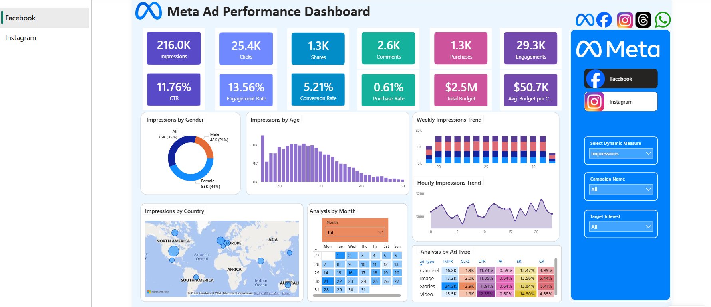

# 📊 Meta Ads Performance Dashboard (Power BI)

## 📌 Project Overview

This project analyzes Meta (Facebook & Instagram) ad campaign performance to provide actionable insights for marketing optimization. The dashboard tracks the full funnel from impressions to purchases and helps identify opportunities to improve conversion rates.

## 📂 Dataset Description

The dataset used in this project simulates Meta (Facebook & Instagram) ad campaign performance and is structured into four main tables:

---

### 1. 📊 Ads Table (`ads.csv`)

Contains information about each advertisement and its targeting details:

* ad_id
* campaign_id
* platform (Facebook / Instagram)
* ad_type (Image, Video, Carousel, Stories)
* target_gender
* target_age_group
* target_interests

---

### 2. 📈 Ad Events Table (`ad_events.csv`)

Captures user interactions with ads across the funnel:

* event_id
* ad_id
* user_id
* timestamp
* day_of_week
* time_of_day (Morning, Afternoon, Evening, Night)
* event_type (Impression, Click, Share, Comment, Purchase)

---

### 3. 📢 Campaigns Table (`campaigns.csv`)

Stores campaign-level details and budget allocation:

* campaign_id
* campaign_name
* start_date
* end_date
* duration
* total_budget

---

### 4. 👥 Users Table (`users.csv`)

Provides demographic and geographic information about users:

* user_id
* user_gender
* user_age
* age_group
* country
* location
* interests

---

### 🔗 Data Relationships

* `ad_id` links Ads and Ad Events tables
* `campaign_id` links Ads and Campaigns tables
* `user_id` links Users and Ad Events tables

---

### 📌 Data Modeling Purpose

This structured data model enables:

* End-to-end funnel analysis (Impressions → Clicks → Engagement → Purchases)
* Audience segmentation (age, gender, interests)
* Campaign and budget performance evaluation
* Time-based trend analysis (daily, weekly, hourly)

---

This design ensures efficient querying and supports advanced analytics using Power BI.

## 🎯 Business Objective

* Track campaign performance across Facebook and Instagram
* Analyze user engagement and conversion behavior
* Optimize budget allocation and improve ROI
* Identify high-performing audience segments

## 📊 Dashboard Features

* KPI Cards:
  Impressions, Clicks, Shares, Comments, Purchases, Engagements

* Performance Metrics:
  CTR (Click Through Rate), Engagement Rate, Conversion Rate, Purchase Rate

* Budget Analysis:
  Total Budget, Average Budget per Campaign

* Funnel Analysis:
  Tracks user journey from Impressions → Clicks → Engagement → Purchases

* Audience Insights:
  Analysis by Age Group and Gender

* Geographic Insights:
  Country-level performance visualization

* Time-based Analysis:

  * Weekly Trends (performance variation across weeks)
  * Hourly Trends (user activity throughout the day)

* Monthly Analysis (Calendar View):

  * Interactive calendar heatmap to analyze performance by date
  * Highlights peak activity days and seasonal trends
  * Custom tooltip on hover showing detailed KPIs (Impressions, Clicks, CTR, Engagement, Budget, etc.)

* Ad Type Performance:
  Comparison across different ad formats (Video, Image, Carousel, Stories)

* Interactive Filters:
  Campaign Name, Target Interest, Platform (Facebook/Instagram), Dynamic Metric Selection

## 💡 Key Insights

* Strong awareness and engagement but drop in conversion rates
* Highest engagement from 18–30 age group, especially females
* Video and Story ads perform best
* Peak engagement during afternoon and evening hours
* Different geographic regions show different performance patterns

## 🛠️ Tools & Technologies

* Power BI
* DAX
* Data Modeling
  
## 🔄 Project Workflow

1. Data Collection from Meta Ads dataset    
2. Data Modeling in Power BI  
3. KPI Calculation using DAX  
4. Dashboard Design & Visualization  
5. Insight Generation & Business Recommendations  

## 📸 Dashboard Screenshots

### Facebook Dashboard

### Instagram Dashboard

## 🎥 Dashboard Demo Video

Click below to watch a walkthrough of the dashboard:

👉 [Watch Demo Video](https://drive.google.com/file/d/1WDwp6Pn6LD7PtHJHXICZnjKgg0foAKtp/view?usp=sharing)

## 📈 Business Impact

- Identifies high-performing ad formats to optimize budget allocation  
- Highlights audience segments with maximum engagement  
- Detects funnel drop-offs to improve conversion strategies  
- Supports data-driven marketing decisions  
